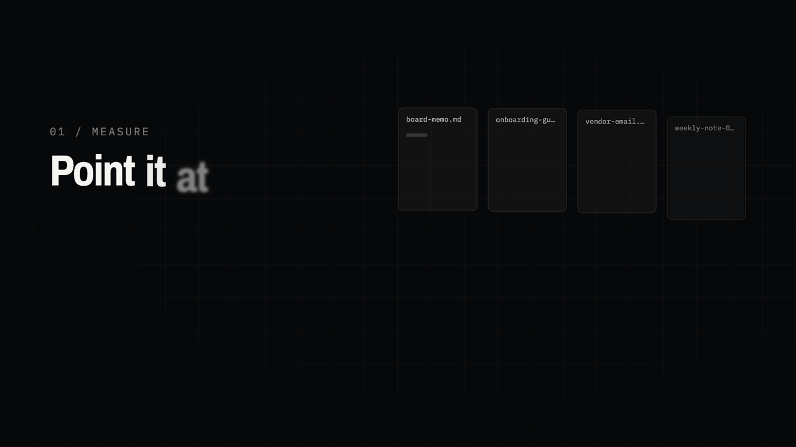
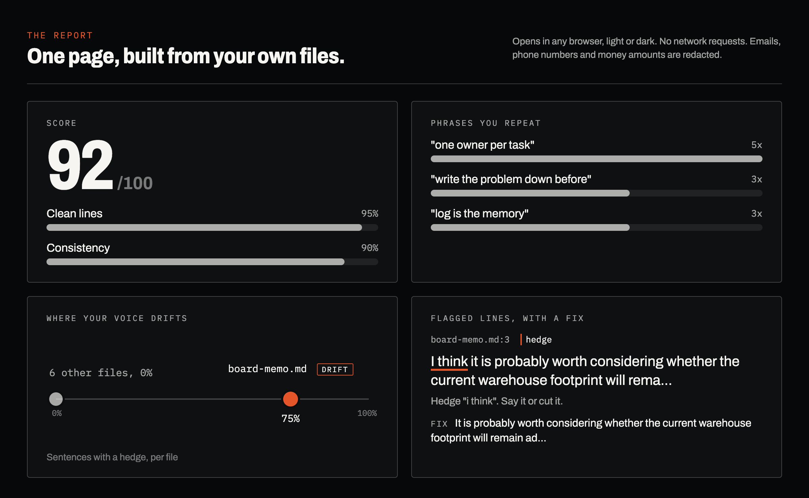
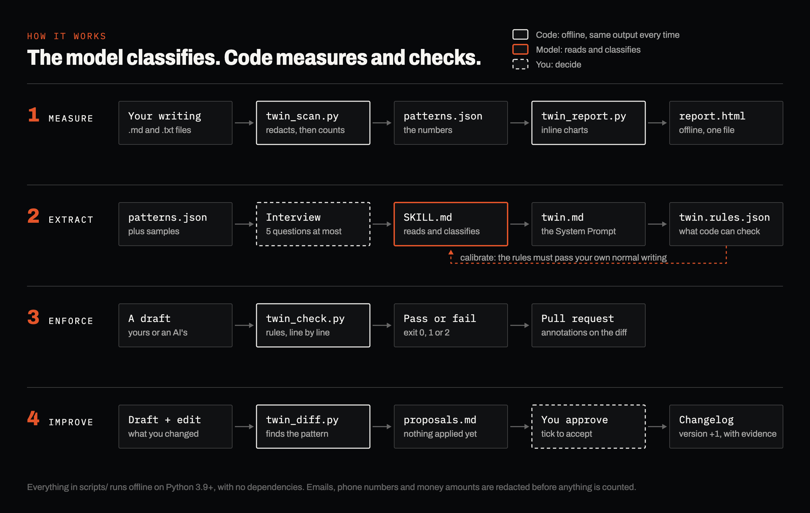

# Digital Twin of Yourself

**See how you actually write. Then check every draft, yours or an AI's, against it.**



*Every number and sentence in this film is the tool's real output on made-up sample writing. Rebuilt by `tools/demo/make_demo.py`.*

## What you get

| You get | What it is |
|---|---|
| **A report on your writing** | One page, opens in any browser. How long your sentences run, how often you hedge, which phrases you lean on, which documents sound unlike the rest, and the exact lines to fix. |
| **A twin any AI can use** | A System Prompt that captures your voice and how you decide, built from your writing plus up to five questions about what the writing does not show. |
| **A checker for every draft** | Rules code can check, line by line. Run it on a draft, or let it check every pull request so off-voice copy is caught before it ships. |
| **A twin that keeps up** | Show it drafts next to what you actually sent. It proposes new rules from your edits. You approve each one, and every change is logged. |



The AI does the judgment calls. Everything that can be counted or checked is done by code: it runs on your machine, gives the same answer every time, and strips emails, phone numbers and money amounts before anything is saved.



Built by [WhyStrohm](https://whystrohm.com).

---

## Try it in three minutes

You need Python 3.9 or newer. Nothing to install. Nothing leaves your machine.

```bash
git clone https://github.com/whystrohm/digital-twin-of-yourself.git
cd digital-twin-of-yourself

# 1. Measure a folder of writing (here, the made-up sample)
python3 scripts/twin_scan.py --corpus examples/sample-corpus --out patterns.json

# 2. Build the report and open it
python3 scripts/twin_report.py patterns.json --out twin-report.html
open twin-report.html        # macOS; use xdg-open on Linux

# 3. Check a draft against a twin's rules
python3 scripts/twin_check.py --rules twins/example/twin.rules.json examples/drafts/supplier-update.md
```

Step 3 fails on purpose: the draft hedges, uses a dash, and runs one sentence to 37 words. `examples/drafts/supplier-update.fixed.md` passes.

To run it on your own writing, copy your own `.md` or `.txt` files into one folder, scrub them (see [Safety](#safety)), and point `--corpus` at that folder.

---

## The layers

The extraction itself is a prompt. How deep it goes depends on what the model can read.

| Layer | Where | What it reads | Who measures |
|---|---|---|---|
| **1** | Any LLM (ChatGPT, Gemini, Claude) | Writing you paste in | The model estimates |
| **2** | Claude with memory on | Your conversation history | The model estimates |
| **3** | Claude Code or Cowork | A folder of your files | `scripts/` measures, the model interprets |

### Layer 1: any LLM
1. Copy [`EXTRACTION_PROMPT.md`](EXTRACTION_PROMPT.md) into a new chat.
2. Paste your writing at the bottom. Five pages or more. Your normal writing, not your best.
3. Let it run every phase, including the stress test.

### Layer 2: Claude with memory
1. Open a new chat in Claude with memory on.
2. Paste [`EXTRACTION_PROMPT.md`](EXTRACTION_PROMPT.md). No samples needed.

### Layer 3: Claude Code
1. `mkdir ~/digital-twin-scan` and copy your scrubbed writing in.
2. Paste [`CLAUDE_CODE_PROMPT.md`](CLAUDE_CODE_PROMPT.md) into Claude Code, from this repo's folder.
3. It runs `twin_scan.py`, reads the numbers instead of guessing them, interviews you about the gaps (at most five questions, one at a time), writes the System Prompt and a `twin.rules.json`, checks the rules against your own writing, and builds the report.

### As a Claude skill
Upload `digital-twin-skill.zip` to Claude.ai (Settings > Skills), or copy `SKILL.md` to `~/.claude/skills/digital-twin/`.

---

## What the code does

All of `scripts/` is standard-library Python. No dependencies, no network calls. Emails, phone numbers and money amounts are redacted when a file is read, before anything is counted or written.

| Script | Input | Output |
|---|---|---|
| `twin_scan.py` | One or more folders of `.md` / `.txt` | `patterns.json`: sentence lengths, hedge rate, question rate, repeated 3 to 5 word phrases, metaphor-family words (from a list you can replace), formatting habits, drift per file. Several `--corpus NAME=PATH` flags add a side-by-side comparison. |
| `twin_report.py` | `patterns.json` | One HTML file. Inline SVG charts, light and dark, no external requests. |
| `twin_check.py` | `twin.rules.json` and drafts | Pass or fail per rule with file, line and column. Exit code 0, 1 or 2, so it can gate CI. `--format github` puts each failure on the line in the pull request diff. `--export-foundrkit` writes the phrase rules for [foundrkit-lint](https://github.com/whystrohm/foundrkit-lint) ([what transfers and what does not](docs/FOUNDRKIT.md)). |
| `twin_diff.py` | Pairs of `NAME.draft.md` and `NAME.edited.md` | `twin.proposals.md`: words you always delete, sentences you always shorten, as proposed rule changes. Nothing applies until you tick it. |

The rules format is in [docs/RULES.md](docs/RULES.md).

### Keep a twin current

```bash
# Put drafts and your edited versions in one folder, then:
python3 scripts/twin_diff.py propose my-edits/ --rules twins/acme/twin.rules.json --out twins/acme/twin.proposals.md
# Read the proposals. Tick "- [x] accept" on the ones you agree with. Then:
python3 scripts/twin_diff.py accept twins/acme/twin.proposals.md --rules twins/acme/twin.rules.json \
  --changelog twins/acme/TWIN_CHANGELOG.md
```

`accept` applies only ticked proposals, bumps the profile version, and writes the change and its evidence to the changelog. It refuses to run if the rules changed after the proposals were written.

### More than one brand or context

Each twin lives in its own folder, versioned in git:

```
twins/
  example/
    twin.md              the System Prompt
    twin.rules.json      the checkable rules, with profile_version
    TWIN_CHANGELOG.md    every accepted change and why
```

Add `twins/<brand>/` for each brand or voice. The tests check that every twin's rules file is valid and that its `brand` matches its folder.

### For teams

Copy [`templates/twin-check.yml`](templates/twin-check.yml) into the repo that holds your writing. Every pull request then checks the drafts it changes against your twin, and each failure appears on the line it came from. [docs/TEAMS.md](docs/TEAMS.md) covers one twin per brand, comparing voices across brands, changing rules by reviewed proposal, and which file answers which audit question.

---

## Validate your Twin

- **[15 stress tests](validation/STRESS_TESTS.md)**: adversarial prompts across high stakes, conflict, ambiguity, context shift and edge cases.
- **[Scoring rubric](validation/RUBRIC.md)**: 10 weighted dimensions, scored by hand.
- **[Blind evaluation](validation/EVAL.md)**: generic AI vs your Twin on all 15 tests, judged blind by a different model against held-out writing, in random order. Optional. It calls a paid API, so run `--dry-run` first for the token estimate.
- **[Worked example](validation/SCORED_EXAMPLE.md)**: the rubric applied to a fictional Twin's answer.

Run the tests for the scripts with `scripts/test.sh`. CI runs the same script.

## Examples

- [Before and after](examples/before-after/): the same prompt answered by generic AI and by a Twin.
- [Sample profiles](examples/sample-profiles/): three complete Twin profiles of fictional people.
- [Sample corpus](examples/sample-corpus/), [drafts](examples/drafts/) and [edit pairs](examples/edit-pairs/): synthetic writing by a fictional operations lead, for trying the scripts.

---

## Safety

The prompts do not collect data, call APIs or run code. The scripts run offline and redact before they write. The risk is in what you feed them.

1. Only use YOUR writing. Never client data or coworker messages.
2. A Twin of another person needs that person's written consent. The same goes for cloning anyone's voice for audio.
3. Scrub names and identifying details before you scan. Redaction catches emails, phone numbers and money amounts, not names.
4. The prompt extracts principles, not data. No names belong in the output.
5. Share your patterns freely. Keep the System Prompt private.
6. Layer 3: use one dedicated folder. Never scan your home directory.
7. Once an AI reads a file, it is in the session. Scrub BEFORE you scan.

Full checklist: [SAFETY_CHECKLIST.md](SAFETY_CHECKLIST.md).

## What's in this repo

```
├── README.md ................. You're here
├── SKILL.md .................. Claude Code / Claude.ai skill
├── digital-twin-skill.zip .... SKILL.md, upload-ready for Claude.ai
├── EXTRACTION_PROMPT.md ...... Layers 1 and 2, any LLM
├── CLAUDE_CODE_PROMPT.md ..... Layer 3, with the scripts
├── SAFETY_CHECKLIST.md ....... Before you paste, scan, or share
├── CHANGELOG.md
├── scripts/ .................. twin_scan, twin_report, twin_check, twin_diff, test.sh
├── twins/example/ ............ A synthetic twin: twin.md, twin.rules.json, changelog
├── docs/ ..................... Rules format, teams guide, foundrkit-lint export
├── templates/ ................ GitHub Actions workflow for your own repo
├── examples/ ................. Before/after, profiles, synthetic sample data
├── validation/ ............... Stress tests, rubric, blind eval
├── tests/ .................... Unit tests on synthetic fixtures
└── tools/demo/ ............... Rebuilds the film, report still, diagram and share card
```

## What's next

Once you have your Twin, score your published content against it:
- **[Content Audit](https://github.com/whystrohm/whystrohm-audit)**: a 5-layer diagnostic that scores your content and rewrites one piece live.
- **[Voice Scorer](https://github.com/whystrohm/whystrohm-voice-scorer)**: measures drift between your website voice and your social content.
- **[Voice Extract](https://github.com/whystrohm/whystrohm-voice-extract)**: a structured voice profile from any URL.
- **[foundrkit-lint](https://github.com/whystrohm/foundrkit-lint)**: runs banned-phrase rules on every commit. `twin_check.py --export-foundrkit` feeds it.
- **[Ritual](https://github.com/whystrohm/ritual)**: schedules the skills to run across every brand you ship.

## Changelog

See [CHANGELOG.md](CHANGELOG.md).

## Work with WhyStrohm

This repo is free and MIT licensed. WhyStrohm builds voice systems like this one into a company's content work.

→ [whystrohm.com/pricing](https://whystrohm.com/pricing?utm_source=github&utm_medium=repo-cta&utm_campaign=2026-04-10-closed-loop)

Or start with the free Scan → [whystrohm.com/scan](https://whystrohm.com/scan?utm_source=github&utm_medium=repo-cta&utm_campaign=twin-v3)

See client proof → [whystrohm.com/results](https://whystrohm.com/results?utm_source=github&utm_medium=repo-cta&utm_campaign=2026-04-10-closed-loop)

## License

MIT. Use it, fork it, improve it.
